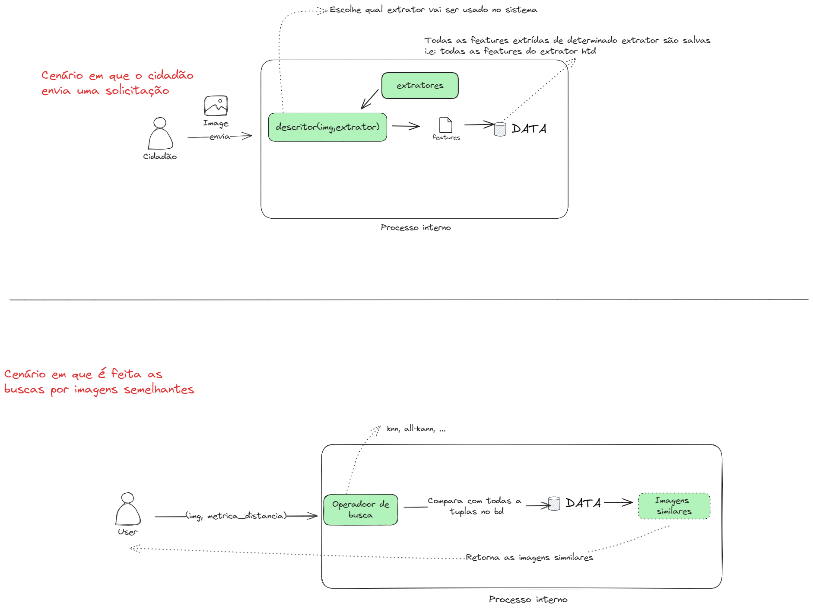

# refat-2 O QUE VAI MUDAR ?

# Reunião 20/05  

- [x] retirar a função de distância de cada classe e criar um nova classe para distâncias
- [x] criar classe  `Descritor` => Link ou agregado de extrator com distância
- [ ] classe operador de busca => dado um objeto, consultar com base em um critéro
  - knn, wide-join, raio de _abrangência (r)_ e quantos _(k)_ devem ser escolhidos

___ 
# Reunião 31/05
- Tirar dúvida com o professor a respeito do fluxo de execução do programa e da arquitetura. Esboçar Possível diagrama de sequência.
- Criar a base de dados em um arquivo .txt
  - id_image, vetor_de_características, geolocalização
  - Criar uma classe para manipular a base de dados
  - Criar uma classe para representar uma tupla da base de dados ??? ex objeto {id_image, vetor_de_características, geolocalização} 
- Gráfico de precisão x revocação (precision x recall)

___ 

# Desing de arquitetura

___

# Reunião 11/06
- [x] Alterar  a classe `Descritor` com a função de distância
- [x] Alterar a classe Distância e implementar as distâncias Euclidiana, Manhattan
- [x] Criar classe para mostrar as imagens; (list_of_images,dir_images)->show_images()